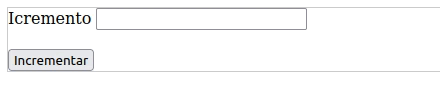

# Operadores de incremento e decremento

- ```-operando```: troca o sinal do operando.
- ```++operando```: conhecido como pré-incremento, primeiro incrementa depois realiza a operação.
- ```--operando```: conhecido como pré-decremento, primeiro decrementa depois realiza a operação.
- ```operando++```: conhecido como pós-incremento, primeiro faz a operação depois incrementa.
- ```operando--```: conhecido como pós-decremento, primeiro faz a operação depois decrementa.

## Exemplo: 
```php
<?php
$num1 = 2;
$num2 = 4;
$num3 = 6;
$num4 = 8;

// 1 - Resultado igual a 3
$resposta1 = ++$num2 - $num1;

// 2 Resultado igual a 8
$resposta2 = $num3-- + $num1;

//Resultado igual a 9
$resposta3 = --$num1 + $num4;
?>
```


- No exemplo 1 antes de ser realizada a operação aritmética entre $num2 e $num1, a variável $num2 é incrementada em 1 para assim realizar a operação.
- No exemplo 2 primeiro é realizada a operação aritmética entre $num3 e $num1, em seguida a variável $num3 é decrementada em 1.
- No exemplo 3 antes de ser realizada a operação aritmética entre $num1 e $num4, a variável $num1 é decrementada em 1 para assim realizar a operação.

- No caso acima apresentamos os operadores aritméticos assim como as operações que incrementam e decrementam de forma simples.


### Exercicio 01
crie um programa com estrutura ```html com form```, que recebe um valor, e cada clique no botão ele e incrementado, faz teste para descrobir, qual operador foi utilizado, pré-incremento ou pós-incremento.

EXEMPLO DE PROGRAMA
<br>


### Exercicio 02
crie um programa com estrutura ```html com form```, que recebe um valor, e cada clique no botão ele e decremente, faça teste para descrobir, qual operador foi utilizado, pré-decremento ou pós-decremento.