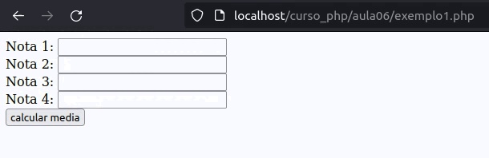

# Operadores de atribuição

No caso de operadores de atribuição, o PHP fornece um operador básico e diversos derivados, estes sempre retornam um valor atribuído. Nos operadores derivados de atribuição, a operação é feita entre os dois operandos, sendo atribuído o resultado ao primeiro. Veja a seguir os operadores de atribuição:

- Atribuição simples(=)
- Atribuição com adição (+=)
- Atribuição com subtração (-=)
- Atribuição com multiplicação (*=)
- Atribuição com divisão (/=)
- Atribuição com módulos (%=)
- Atribuição com concatenação (.=)

## Exemplos 01
```php
<?php

//Declaração das variáveis e atribuições simples
$SOMAR = 0;
$numero1 = 2;
$numero2 = 3;
$numero3 = 4;

//Atribuição com adição
$SOMAR += $numero1;
$SOMAR += $numero2;

//Atribuição com multiplicação
$SOMAR *= $numero3;

//Atribuição com módulos
$SOMAR %= 3;

echo $SOMAR;
?>
```

Crie um programa com estrutura ```html com form```,um formulario com 4 inputs, que receba a notas de joãozinho, calcule e tire a media do resultado. não será nescessario usar ```header()``` para redirecionamento.

EXEMPLO DE PROGRAMA
<br>



Crie um programa com estrutura ```html com form```, com o operador de 'Atribuição com adição (+=)' faça um contador, que incremente com o valor anterios dele,

EXEMPLO DE PROGRAMA
<br>
